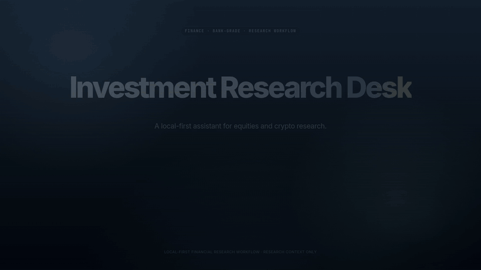

[English](README.md) | [中文](README.zh.md)

<div align="center">
  <h1>Investment Research Desk</h1>
  <p><strong>A local-first multi-agent research desk for equities and crypto.</strong></p>
  <p>Turn market data, news, macro context, sentiment, technical structure, optional QLoRA refinement, and bull/bear debate into a structured research brief for human review.</p>
  <p>
    
    
    
    
  </p>
  <p>
    <a href="#what-this-project-is">What this project is</a> ·
    <a href="#what-it-looks-like">Preview</a> ·
    <a href="#quick-start">Quick start</a> ·
    <a href="#repository-structure">Repository structure</a> ·
    <a href="#which-file-should-i-read-first">Where to read first</a>
  </p>
</div>

---

<p align="center">
  
</p>

<div align="center">
  <sub>▲ Hero animation made with <a href="https://github.com/alchaincyf/huashu-design/tree/master">huashu-design</a></sub>
</div>

---

## What this project is

Investment Research Desk is a **local CLI-first multi-agent research system**. It collects market data, news, macro context, sentiment inputs, technical indicators, and bull/bear argumentation, then compresses them into a structured research context package.

It is built for:
- personal research workflows
- repeatable local experimentation
- auditable multi-agent analysis
- producing downstream-ready research artifacts such as JSON, traces, metrics, and Markdown briefs

## What you get

- A guided CLI workflow through `ird`
- A LangGraph pipeline with a specialist analyst team:
  - Fundamental / Macro Analyst
  - News / Macro Impact Analyst
  - Sentiment Analyst
  - Technical Analyst
- A bull vs. bear debate layer before the final report
- Structured outputs with contracts, traces, metrics, and guardrails
- Offline fixture mode for stable demos and regression tests
- Optional WSL2 + CUDA QLoRA fine-tuning and adapter evaluation path
- English and Chinese report output modes

## Optional QLoRA fine-tuning path

The optional LoRA path is designed for **WSL2 + CUDA** and adds a reproducible adapter-training and held-out evaluation workflow alongside the standard local CLI.

### Baseline vs. fine-tuned evaluation

The repository currently hardcodes the baseline metrics in `investment_research_desk/lora/sentiment.py`, and the fine-tuned row is tracked in `eval/results/lora_full/heldout_eval_results.json`.

| Variant | ACC | Macro-F1 | Source |
| --- | ---: | ---: | --- |
| Baseline Qwen3-8B forced-choice classifier | 0.7900 | 0.7771 | `investment_research_desk/lora/sentiment.py` |
| Fine-tuned adapter | 0.8926 | 0.8760 | `eval/results/lora_full/heldout_eval_results.json` |

That is a held-out gain of **+0.1026 ACC** and **+0.0989 Macro-F1** over the checked-in baseline.

Setup and smoke test:

```bash
bash scripts/wsl/setup_lora_env.sh
bash scripts/wsl/run_lora_pipeline.sh smoke
```

Run a full training/eval cycle:

```bash
bash scripts/wsl/run_lora_pipeline.sh full
```

Run a report with the latest adapter:

```bash
export IRD_SENTIMENT_ADAPTER_PATH=models/investment-research-desk-lora-sentiment/<timestamp>/adapter
bash scripts/wsl/run_adapter_report.sh ETH-USDT-SWAP
```

Read more in:
- [`docs/wsl_lora_adapter_guide.md`](docs/wsl_lora_adapter_guide.md)
- [`docs/lora_training_wsl.md`](docs/lora_training_wsl.md)

## What it looks like

The repository already includes real screenshots from the current CLI experience.

### Interactive workflow


### Live multi-agent runtime


### Final research context report


## Quick start

### Standard local path

```bash
git clone https://github.com/Parsiffal1/Investment-Research-Desk.git
cd Investment-Research-Desk
uv sync
cp .env.example .env
uv run ird config check
uv run pytest
```

### Run the CLI

```bash
uv run ird
```

### Run a single report

```bash
uv run ird report \
  --symbol ETH-USDT-SWAP \
  --asset-class crypto \
  --horizon short_term \
  --llm-provider ollama \
  --language zh
```

### Run the offline demo

```bash
uv run ird demo
```

## Recommended workflow

1. Use `uv run ird config check` to verify your environment and providers.
2. Start with `uv run ird demo` if you want to understand the full flow without live APIs.
3. Run `uv run ird` for the guided interactive flow.
4. Inspect `runs/<run_id>/` to review artifacts, traces, metrics, and the final brief.
5. Only move to the WSL LoRA path if you want adapter training, held-out evaluation, and the optional fine-tuned runtime path.

## How the system works

```text
Run Controller
  -> Analyst Team
     -> Fundamental / Macro Analyst
     -> News / Macro Impact Analyst
     -> Sentiment Analyst
     -> Technical Analyst
  -> Bull / Bear Research Debate
     -> Bull Researcher
     -> Bear Researcher
     -> Debate Moderator
  -> Research Reporter
  -> final_market_context_cache
  -> persist artifacts
```

Important boundaries:
- The output is **research context only**.
- The project does **not** place orders or manage accounts.
- The system enforces tool budgets, financial-scope query rules, relevance filtering, and output guardrails.
- The optional LoRA path is additive: it complements the research workflow without replacing the multi-agent report pipeline.

## Data sources

Supported live and fallback inputs currently include:
- **OKX** public SWAP market context and OHLCV
- **Yahoo Finance**
- **FMP**
- **Finnhub**
- **Tavily**
- **StockTwits**
- **Reddit**
- **Jin10**
- **Local fixtures**

Provider failures such as free-tier `402/403` responses are kept in status and trace artifacts rather than being promoted into direct business conclusions.

## Repository structure

```text
investment_research_desk/
  agents/           Agent contracts, prompts, and core analyst logic
  dataflows/        Vendor routing and tool wrappers
  eval/             Lightweight evaluation suites
  graph/            LangGraph workflow orchestration
  llm/              Fake and Ollama-compatible LLM clients
  lora/             QLoRA data prep, training, and held-out evaluation
  providers/        External and fixture data adapters
  tools/            Deterministic indicators, guardrails, metrics
  cli.py            Main CLI entrypoint
  schemas.py        Shared Pydantic schemas
  sentiment_runtime.py

docs/
  README.md                    Documentation index
  current_implementation.md    Current implemented behavior
  windows_cli_guide.md         Regular Windows CLI usage
  wsl_lora_adapter_guide.md    Run reports with the LoRA adapter in WSL
  lora_training_wsl.md         WSL training workflow

scripts/wsl/
  setup_lora_env.sh
  run_lora_pipeline.sh
  run_adapter_report.sh
  verify_lora_env.py
  start_ollama_bridge.ps1
  install_wsl_ubuntu_admin.ps1

data/fixtures/
  gold_cpi.json                Offline fixture for demo and tests

models/
  investment-research-desk-lora-sentiment/.../adapter/

runs/                          Local run artifacts (gitignored)
tests/                         Regression and workflow tests
```

## Which file should I read first?

- Want the product-level overview? Read **this README** first.
- Want a documentation map? Read [`docs/README.md`](docs/README.md).
- Want the exact currently implemented behavior? Read [`docs/current_implementation.md`](docs/current_implementation.md).
- Want normal local usage without LoRA training? Read [`docs/windows_cli_guide.md`](docs/windows_cli_guide.md).
- Want the WSL adapter runtime path? Read [`docs/wsl_lora_adapter_guide.md`](docs/wsl_lora_adapter_guide.md).
- Want the training path for the sentiment adapter? Read [`docs/lora_training_wsl.md`](docs/lora_training_wsl.md).
- Want to understand orchestration internals? Read [`investment_research_desk/graph/workflow.py`](investment_research_desk/graph/workflow.py).
- Want to understand the analyst contracts and guardrails? Read [`investment_research_desk/agents/contracts.py`](investment_research_desk/agents/contracts.py) and [`investment_research_desk/tools/guardrails.py`](investment_research_desk/tools/guardrails.py).

## Configuration

Typical `.env` fields:

```text
IRD_OLLAMA_BASE_URL=http://localhost:11434/v1
IRD_OLLAMA_MODEL=qwen3:8b
IRD_DEFAULT_LLM_PROVIDER=auto

OKX_BASE_URL=https://www.okx.com
TAVILY_API_KEY=your_tavily_api_key
FMP_API_KEY=your_fmp_api_key
FINNHUB_API_KEY=your_finnhub_api_key
JIN10_API_KEY=your_jin10_api_key

IRD_AGENT_EXECUTION_MODE=sequential
IRD_LLM_TIMEOUT_SEC=180
IRD_AGENT_TOOL_LOOP_TIMEOUT_SEC=240
IRD_AGENT_MAX_TOOL_CALLS=8
IRD_REPORT_LANGUAGE=en
```

Keep real secrets in `.env` only. Do not commit them. `.env.example` should remain sanitized.

## Run artifacts

Every run writes a local folder such as:

```text
runs/{run_id}/
  input.json
  agent_contracts.json
  normalized_data.json
  analyst_outputs.json
  analyst_team_outputs.json
  bull_risk_outputs.json
  research_debate.json
  final_market_context_cache.json
  final_research_context.json
  research_brief.md
  trace.json
  metrics.json
```

This is one of the main strengths of the project: the workflow is not just interactive, it is also inspectable after the run.

## Testing

Run the full suite:

```bash
uv run pytest
```

The repository includes workflow tests, CLI tests, provider tests, LoRA-path tests, and evaluation regression coverage.

## Project status and boundaries

Current scope:
- local-first CLI research workflow
- multi-agent structured analysis
- live + fixture-backed runs
- optional QLoRA adapter path

Not in scope:
- order placement
- account access
- portfolio rebalancing
- broker integration
- autonomous trading

## License

MIT License. See [`LICENSE`](LICENSE).

## Disclaimer

Investment Research Desk is research software. It generates structured context for human review. It is not a broker, exchange, financial advisor, trading system, or execution engine.
