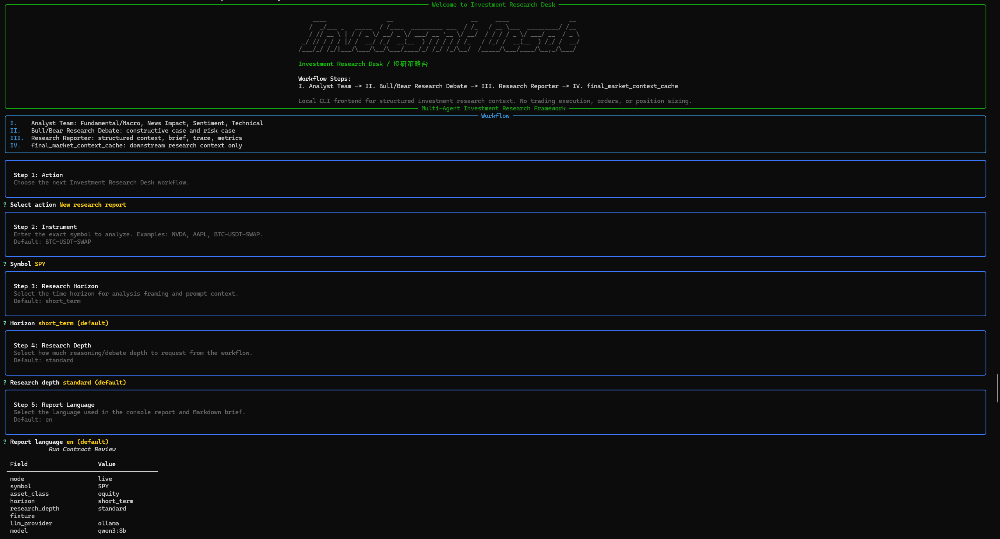
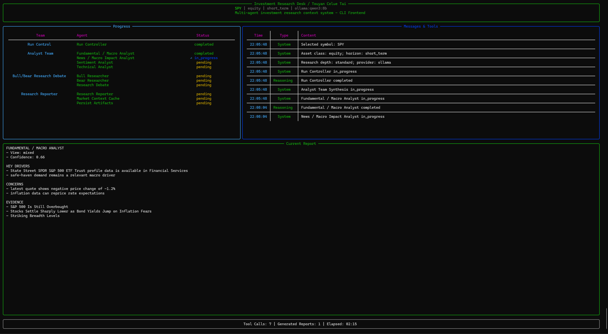
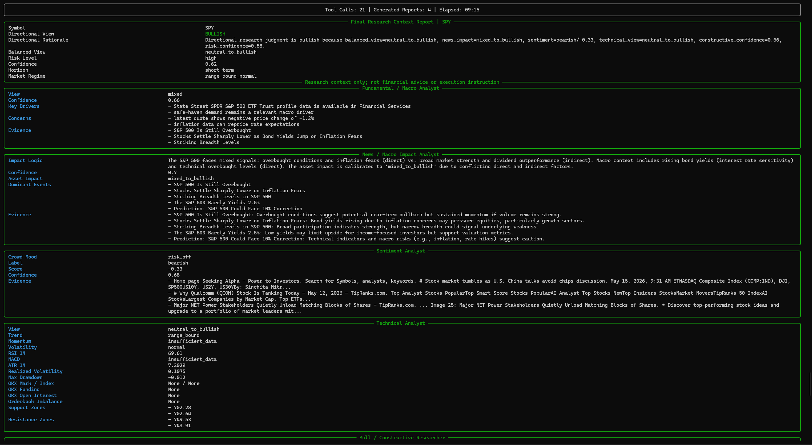

[English](README.md) | [中文](README.zh.md)

<div align="center">
  <h1>Investment Research Desk / 投研策略台</h1>
  <p><strong>一个面向股票和加密资产的本地优先多 Agent 投研工作台。</strong></p>
  <p>把市场数据、新闻、宏观事件、情绪输入、技术结构和 Bull / Bear 辩论整理成结构化投研材料，方便人工复核和后续研究消费。</p>
  <p>
    
    
    
    
  </p>
  <p>
    <a href="#这个项目是什么">这个项目是什么</a> ·
    <a href="#界面预览">界面预览</a> ·
    <a href="#快速开始">快速开始</a> ·
    <a href="#仓库结构">仓库结构</a> ·
    <a href="#我应该先看哪个文件">我应该先看哪个文件</a>
  </p>
</div>

---

<p align="center">
  
</p>

<div align="center">
  <sub>▲ Hero animation made with <a href="https://github.com/alchaincyf/huashu-design/tree/master">huashu-design</a></sub>
</div>

---

## 这个项目是什么

Investment Research Desk / 投研策略台是一个**本地 CLI-first 的多 Agent 投研系统**。它会把市场行情、新闻与宏观上下文、情绪输入、技术指标和多空论证整合成一份结构化研究结果。

它适合：
- 个人投研工作流
- 可重复的本地实验
- 可审计的多 Agent 分析流程
- 需要沉淀 JSON、trace、metrics、Markdown brief 等研究产物的场景

它**不是**券商、下单系统、资管工具，也不提供投资建议。

## 你能得到什么

- 一个通过 `ird` 运行的引导式 CLI 工作流
- 一条基于 LangGraph 的多 Agent 编排链路
- 四类专职 analyst：
  - Fundamental / Macro
  - News / Macro Impact
  - Sentiment
  - Technical
- 在最终报告前加入 Bull / Bear research debate
- 带 contracts、traces、metrics、guardrails 的结构化输出
- 可稳定复现的离线 fixture 模式
- 只作用于 Sentiment Analyst 的可选 WSL2 + CUDA LoRA adapter
- 中英文两种报告输出模式

## 界面预览

仓库里已经包含了当前 CLI 的真实截图，可以直接看到产品形态。

### 交互式工作流



### 实时多 Agent 运行面板



### 最终研究报告



## 快速开始

### 常规本地运行路径

```bash
git clone https://github.com/Parsiffal1/Investment-Research-Desk.git
cd Investment-Research-Desk
uv sync
cp .env.example .env
uv run ird config check
uv run pytest
```

### 启动 CLI

```bash
uv run ird
```

### 运行单次报告

```bash
uv run ird report \
  --symbol ETH-USDT-SWAP \
  --asset-class crypto \
  --horizon short_term \
  --llm-provider ollama \
  --language zh
```

### 运行离线演示

```bash
uv run ird demo
```

## 推荐使用流程

1. 先运行 `uv run ird config check` 检查环境与 provider 状态。
2. 如果想先理解完整流程，不想依赖实时 API，先跑 `uv run ird demo`。
3. 正常使用时运行 `uv run ird` 进入引导式交互流程。
4. 跑完后重点看 `runs/<run_id>/` 下的 artifacts、trace、metrics 和 brief。
5. 只有在你确实需要可选情绪适配器时，再进入 WSL LoRA 路径。

## 系统怎么工作

```text
Run Controller
  -> Analyst Team
     -> Fundamental / Macro Analyst
     -> News / Macro Impact Analyst
     -> Sentiment Analyst
     -> Technical Analyst
  -> Bull / Bear Research Debate
     -> Bull Researcher
     -> Bear Researcher
     -> Debate Moderator
  -> Research Reporter
  -> final_market_context_cache
  -> persist artifacts
```

几个关键边界：
- 所有输出都只是**投研上下文**。
- 项目**不会**下单，也不会管理账户。
- 系统会强制执行 tool budget、金融范围约束、relevance filtering 和输出 guardrails。
- 可选 LoRA adapter **只影响 Sentiment Analyst**，不会替换整个报告流水线。

## 数据源

当前支持的实时与 fallback 输入包括：
- **OKX** 公共 SWAP 市场上下文与 OHLCV
- **Yahoo Finance**
- **FMP**
- **Finnhub**
- **Tavily**
- **StockTwits**
- **Reddit**
- **Jin10**
- **本地 fixtures**

像免费额度 `402/403` 这类 provider 错误，会保存在状态与 trace 里，而不是直接被当作研究结论写进最终输出。

## 仓库结构

```text
investment_research_desk/
  agents/           Agent contracts、prompts 与核心分析逻辑
  dataflows/        Vendor 路由与 tool 包装层
  eval/             轻量评测套件
  graph/            LangGraph 工作流编排
  llm/              Fake 与 Ollama-compatible LLM client
  lora/             Sentiment LoRA 数据准备、训练与评估
  providers/        外部数据源与 fixture adapter
  tools/            确定性指标、guardrails、metrics
  cli.py            主 CLI 入口
  schemas.py        共享 Pydantic schema
  sentiment_runtime.py

docs/
  README.md                    文档导航页（英文）
  README.zh.md                 文档导航页（中文）
  current_implementation.md    当前已实现能力说明
  windows_cli_guide.md         常规 Windows CLI 使用说明
  wsl_lora_adapter_guide.md    在 WSL 中使用 LoRA adapter 跑报告
  lora_training_wsl.md         WSL 训练流程

scripts/wsl/
  setup_lora_env.sh
  run_lora_pipeline.sh
  run_adapter_report.sh
  verify_lora_env.py
  start_ollama_bridge.ps1
  install_wsl_ubuntu_admin.ps1

data/fixtures/
  gold_cpi.json                用于 demo 与测试的离线 fixture

models/
  investment-research-desk-lora-sentiment/.../adapter/

runs/                          本地运行产物（已 gitignore）
tests/                         回归测试与工作流测试
```

## 我应该先看哪个文件？

- 想先快速理解项目定位？先看**这份 README**。
- 想看文档总导航？看 [`docs/README.zh.md`](docs/README.zh.md)。
- 想知道当前到底实现了什么？看 [`docs/current_implementation.md`](docs/current_implementation.md)。
- 想正常本地使用，但不碰 LoRA 训练？看 [`docs/windows_cli_guide.md`](docs/windows_cli_guide.md)。
- 想在 WSL 中启用 adapter 路径？看 [`docs/wsl_lora_adapter_guide.md`](docs/wsl_lora_adapter_guide.md)。
- 想训练情绪 adapter？看 [`docs/lora_training_wsl.md`](docs/lora_training_wsl.md)。
- 想理解工作流编排？看 [`investment_research_desk/graph/workflow.py`](investment_research_desk/graph/workflow.py)。
- 想理解 agent contract 和安全边界？看 [`investment_research_desk/agents/contracts.py`](investment_research_desk/agents/contracts.py) 与 [`investment_research_desk/tools/guardrails.py`](investment_research_desk/tools/guardrails.py)。

## 配置

常见 `.env` 字段如下：

```text
IRD_OLLAMA_BASE_URL=http://localhost:11434/v1
IRD_OLLAMA_MODEL=qwen3:8b
IRD_DEFAULT_LLM_PROVIDER=auto

OKX_BASE_URL=https://www.okx.com
TAVILY_API_KEY=your_tavily_api_key
FMP_API_KEY=your_fmp_api_key
FINNHUB_API_KEY=your_finnhub_api_key
JIN10_API_KEY=your_jin10_api_key

IRD_AGENT_EXECUTION_MODE=sequential
IRD_LLM_TIMEOUT_SEC=180
IRD_AGENT_TOOL_LOOP_TIMEOUT_SEC=240
IRD_AGENT_MAX_TOOL_CALLS=8
IRD_REPORT_LANGUAGE=en
```

真实密钥只放在 `.env` 里，不要提交。`.env.example` 应始终保持为脱敏占位版本。

## 运行产物

每次运行都会生成一个本地目录，例如：

```text
runs/{run_id}/
  input.json
  agent_contracts.json
  normalized_data.json
  analyst_outputs.json
  analyst_team_outputs.json
  bull_risk_outputs.json
  research_debate.json
  final_market_context_cache.json
  final_research_context.json
  research_brief.md
  trace.json
  metrics.json
```

这也是项目的重要价值之一：它不仅能跑交互流程，还能把整个过程沉淀为可复查的本地产物。

## 可选 Sentiment LoRA 路径

可选 LoRA 路径面向 **WSL2 + CUDA**，并且只定制情绪分类这一条支路。

环境准备与 smoke test：

```bash
bash scripts/wsl/setup_lora_env.sh
bash scripts/wsl/run_lora_pipeline.sh smoke
```

使用最新 adapter 跑报告：

```bash
export IRD_SENTIMENT_ADAPTER_PATH=models/investment-research-desk-lora-sentiment/<timestamp>/adapter
bash scripts/wsl/run_adapter_report.sh ETH-USDT-SWAP
```

进一步阅读：
- [`docs/wsl_lora_adapter_guide.md`](docs/wsl_lora_adapter_guide.md)
- [`docs/lora_training_wsl.md`](docs/lora_training_wsl.md)

## 测试

运行全量测试：

```bash
uv run pytest
```

仓库里已经覆盖了 workflow、CLI、provider、LoRA 路径和 eval 套件相关测试。

## 项目状态与范围

当前范围：
- 本地优先 CLI 投研工作流
- 多 Agent 结构化分析
- live + fixture 双路径运行
- 可选 sentiment adapter 路径

当前不做：
- 下单执行
- 账户访问
- 投资组合再平衡
- 券商接入
- 自动化交易

## 许可证

MIT License，见 [`LICENSE`](LICENSE)。

## 免责声明

Investment Research Desk 是投研软件。它提供的是供人工复核的结构化研究上下文，不是券商、交易所、投资顾问、自动交易系统，也不是执行引擎。
